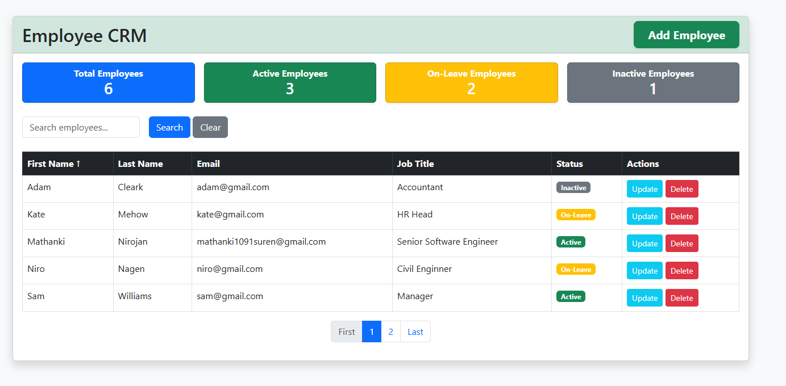

# 🚀 Employee CRM: Employee Management System

A robust, full-stack CRM and Employee Management application designed for efficient workforce tracking. This project demonstrates modern Java web development practices using the latest Spring ecosystem.

## 🛠 Tech Stack

* **Framework:** Spring Boot 3.2.3
* **Web/MVC:** Spring MVC (Request routing & Controller logic)
* **Templating Engine:** Thymeleaf (Server-side HTML rendering)
* **Data Access:** Spring Data JPA & Hibernate (ORM)
* **Database:** MySQL 8
* **Validation:** Jakarta Bean Validation (Field-level constraints)
* **Utilities:** Lombok (Boilerplate reduction)

## ✨ Key Features

* **Full CRUD Operations:** Create, Read, Update, and Delete employee records.
* **Data Validation:** Robust server-side validation for employee details (Email, Name, etc.).
* **Dynamic UI:** Responsive views powered by Thymeleaf and Bootstrap.
* **Database Integration:** Persistent storage with optimized connection pooling.
* **Clean Architecture:** Separated layers for Controllers, Services, and Repositories.

## ✨ Dashboard Preview

